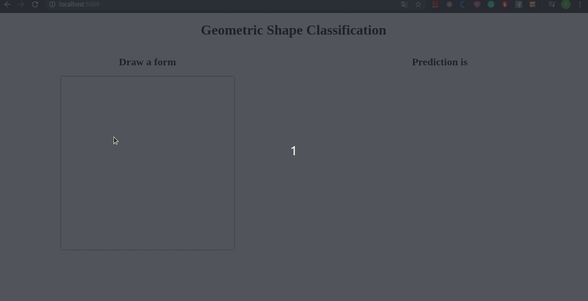

## Geometric shape classification

The goal of this project is to create little web-app, where you can draw with your mouse a geometric form like a circle, and predict with a CNN (convolutional neural network) machine learning Model, what is this form on this image ?  

